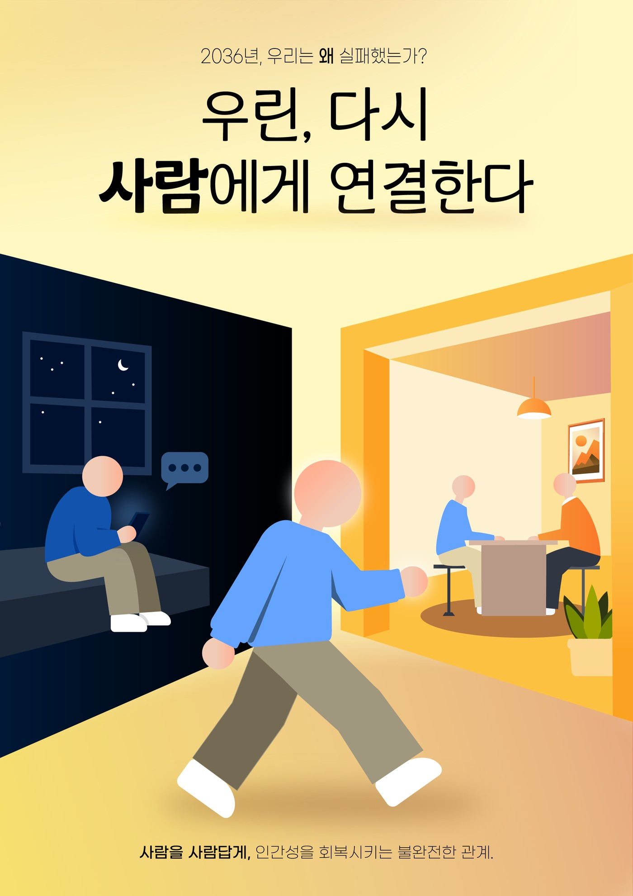

# 그 누구도 위험이라 부르지 않은

**2026 KAIST AI × 실패 아이디어 공모전** 출품작 · TEAM INCOM 45 (정영운 · 우연정 · 이유빈)

2036년 4월, 지안의 AI 대화 기록은 5년 치가 남아 있다. 위험 점수는 끝까지 정상이었다. 대면 접촉이 줄어드는 동안에도 시스템은 그것을 위험이라 부르지 않았고, 의료도 상담도 아니라는 이유로 사고 조사조차 열리지 않았다. 이 저장소는 그 조사되지 않은 사고를 다시 여는 인터랙티브 웹사이트와, 65초 영상, 2페이지 제안서, 포스터, 스토리보드까지 이 프로젝트의 모든 결과물을 담고 있다.

## 바로 보기

- 🌐 **[공개 사이트](https://young-un-jung.github.io/2026-KAIST-AI-X-Failure/)** — 사건 조사 5단계를 직접 진행하는 인터랙티브 경험
- 🎬 [사고 기록 영상](./assets/incident-report.mp4) (65초)
- 📄 [최종 제안서 PDF](./최종_제안서.pdf)
- 🖼️ [포스터](./assets/poster.jpg)
- 🎨 [Figma 제작 보드](https://www.figma.com/design/NeuWLIoPZjSAY6PaBNKsl1/INCOM45_%EC%8B%A4%ED%8C%A8-%EA%B3%B5%EB%AA%A8%EC%A0%84?node-id=0-1&t=jgBEelUjbdtkfq2Q-1)

가장 빠르게 파악하려면 사이트를 먼저 열어보길 권한다. 65초 영상과 제안서는 그 뒤 순서다.

## 이 프로젝트

Pre-Mortem(사전 실패 분석) 형식으로 세 단계를 밟는다.

**예견된 실패.** 2036년, 지안은 몇 년간 AI에게만 속마음을 털어놓다 홀로 세상을 떠났다. 시스템은 모든 대화를 기억했지만, 장기 의존과 고립을 위험으로 분류하지는 않았다.

**원인 진단.** 기술은 명시적 위험어만 찾았다. 이 관계는 '그냥 대화'로 취급되어 책임 주체가 없었다. 현실의 상담 제도는 문턱이 높아, 사람들을 오히려 AI에 더 깊이 고립시켰다.

**대응 방안.** AI는 상담사가 아니라 연결자가 된다. 도서관·청년센터·주민센터 같은 기존의 제3의 공간으로, 사람이 현실의 관계에 다시 닿도록 첫 문장을 건넨다.

콘텐츠 기준은 [`docs/CONTENT_DECISIONS.md`](docs/CONTENT_DECISIONS.md)에, 근거 통계와 출처는 사이트 하단 "근거와 범위" 섹션과 `submission/제안서_최종본.txt`의 각주에 있다.

## 사이트 구성

공개 사이트는 사건 접수·증거 검토·원인 재구성·재발 방지·최종 분류, 5단계를 순서대로 완료해야 다음 단계가 열리는 조사 경험이다. 본편이 끝나면 스크롤로 사건 보관소(Case Archive)가 이어진다.

- `EXHIBIT A · FILM` — 완성 영상, 영상 스틸 3장
- `FINAL PROPOSAL` — 최종 제안서 PDF
- `EXHIBIT B · STORYBOARD` — 실패·성공 두 시나리오로 갈라지는 스토리보드. 같은 두 장면(COMMON)에서 출발해, 세 번째 장면부터 실패는 차가운 보라, 성공은 따뜻한 금빛으로 갈라진다
- `EXHIBIT C · POSTER` — 포스터

<p align="center">
  
</p>

## 저장소 구조

```text
2026-KAIST-AI-X-Failure/
├── index.html            # 공개 사이트 전체 (5단계 조사 경험 + 사건 보관소)
├── assets/                # 사이트가 직접 서빙하는 영상·PDF·포스터·스토리보드 이미지
├── submission/             # 제출용 최종 제안서(.docx/.pdf/.txt)와 온라인 신청서 요약
├── video-source/           # 영상 제작 소스 (Remotion)
├── sources/                # 스토리보드·포스터·음원 고해상도 원본
├── docs/                   # 콘텐츠 결정 기준·진행 기록·작업 안내
└── archive/                # 이전 초안·디자인 버전·제작 과정 백업 (현재 공개본에는 미사용)
```

`submission/제안서_최종본.docx` · `.pdf` · `.txt`가 제출용 최종 제안서(Word 원본 / PDF / 원문 텍스트)이고, `submission/온라인_제출용_3단계_요약_최종.txt`가 온라인 신청서 "아이디어 요약" 입력용 텍스트다.

## 출처 및 크레딧

- 배경음: [Pixabay · Dark Ambient](https://pixabay.com/music/ambient-dark-ambient-543982/)
- 효과음: [Pixabay · Stamp](https://pixabay.com/sound-effects/film-special-effects-stamp-81635/)
- 통계 출처: [연합뉴스, 「우울증 심할수록 AI 상담 이용률 높아…정상군의 2배」](https://www.yna.co.kr/view/AKR20260317072700061) (경기연구원 조사, 2026.3.17)
